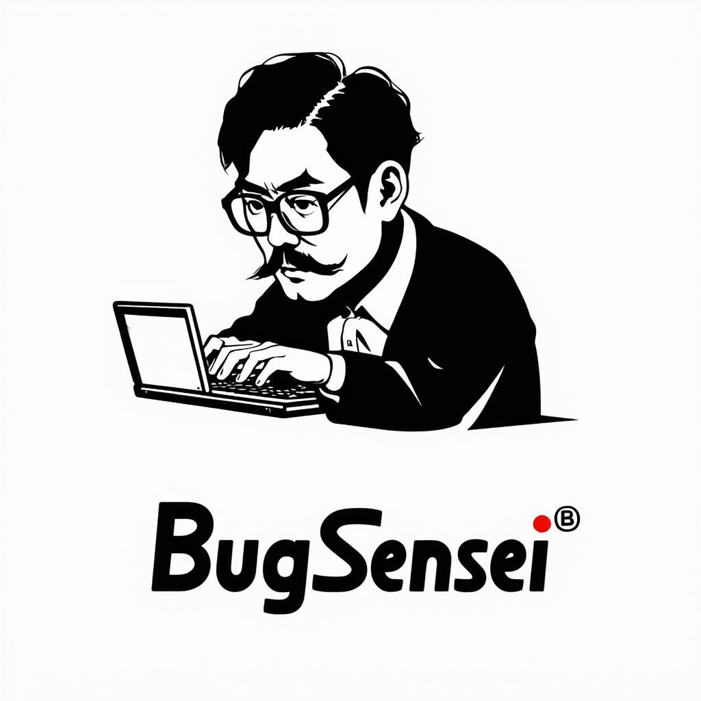
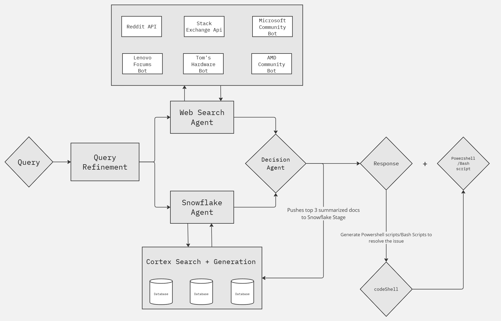

# BugSensei

<p align="center">
  
</p>

## Architecture



## .env / Secrets.toml

```
REDDIT_USERNAME = 
REDDIT_PASSWORD = 
REDDIT_CLIENT_ID = 
REDDIT_SECRET_KEY = 


STACK_EXCHANGE_ACCESS_TOKEN = 
STACK_EXCHANGE_SECRET_KEY = 

MISTRAL_API_KEY = 

TAVILY_API_KEY =""

SNOWFLAKE_ACCOUNT = ""
SNOWFLAKE_USER = ""
SNOWFLAKE_PASSWORD = ""
SNOWFLAKE_wAREHOUSE = ""
SNOWFLAKE_DATABASE = ""
SNOWFLAKE_SCHEMA = ""
```
